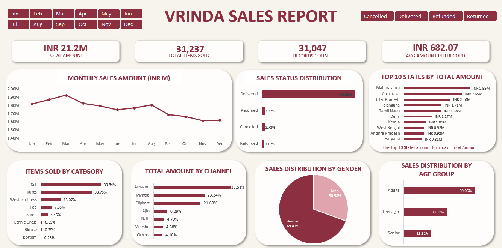

# Vrinda Sales Analysis

**English** | [Português](README_PT_BR.md)

### Excel Data Analysis & Interactive Dashboard Project

This project analyzes 2022 sales data from **Vrinda**, a fictional store, to explore sales performance and identify patterns across customer profiles, products, sales channels, and geographic distribution.

The project was developed in **Microsoft Excel** and includes data preparation, exploratory analysis, an interactive dashboard, and an executive presentation of the main findings.

---

## Dashboard

The interactive Excel dashboard allows users to explore the main sales indicators by **month** and **sales status**.

---

## Key Findings

- **92.25%** of sales records were classified as Delivered, while Returned, Cancelled, and Refunded accounted for a considerably smaller share. However, the share of returns increased toward the end of the year.

- **Women represented 69.4%** of Delivered sales records, while Adults accounted for approximately half of them and had an average age of **40 years**.

- **Set, Kurta, and Western Dress** accounted for approximately **86.6% of items sold** among Delivered records, showing a strong concentration across a small number of product categories.

- **Amazon, Myntra, and Flipkart** accounted for approximately **80.4% of the sales amount** among Delivered records.

- **Maharashtra, Karnataka, and Uttar Pradesh** had the highest sales amounts among states, together accounting for approximately **36.5% of the sales amount** among Delivered records.

---

## Tools & Techniques

- Microsoft Excel
- Data cleaning and standardization
- Excel formulas
- PivotTables and PivotCharts
- Slicers and custom lists
- Exploratory Data Analysis (EDA)
- Interactive dashboard development
- Data visualization and business storytelling

---

## Data Preparation

Before the analysis, the dataset was reviewed to identify potential inconsistencies, duplicate records, missing values, and standardization issues.

No fully duplicated records or null values were found. Product categories, city and state names were standardized, and an auxiliary column with month names in English was created for use in the analysis and dashboard.

Inconsistencies were identified in the `Order ID` and `Cust ID` fields. Since the available data did not provide enough information to determine the correct values, these fields were treated as a dataset limitation rather than corrected or used as unique identifiers.

---

## Analysis

The exploratory analysis examined sales performance from different perspectives, including:

- Monthly sales trends
- Sales status distribution
- Customer gender and age groups
- Product categories and sizes
- Sales channels
- Geographic distribution

Based on the exploratory analysis, the main indicators and dimensions were selected for the interactive dashboard and executive presentation.

---

## Data Quality & Analysis Limitations

Inconsistencies were identified between `Order ID`, `Cust ID`, and some customer-related attributes. Since there was not enough information about the source and structure of the data to determine which records were correct, no rows were removed based on these identifiers.

Therefore, `Order ID` and `Cust ID` were not treated as unique identifiers. The analysis was conducted at the **sales-record level**, avoiding metrics that depended on the unique identification of orders or customers.

The dataset also does not contain information about inventory or product availability. Therefore, it is not possible to determine whether a product had low sales because of low demand or limited availability.

Although records with Returned, Cancelled, and Refunded statuses can be analyzed, the dataset does not provide the reasons behind these events. Therefore, the increase in returns toward the end of the year could be identified, but its causes could not be determined from the available data.

---

## Project Files

- **[Excel Analysis & Interactive Dashboard](Vrinda_Sales_Analysis.xlsx)** — complete workbook containing the exploratory analysis, PivotTables, data dictionary, cleaned data, and interactive dashboard.

- **[Executive Sales Report](Vrinda_Sales_Report.pdf)** — presentation summarizing the main findings, areas to explore for sales growth, and points for further investigation.

---

## Dataset

The original dataset is publicly available on Kaggle:

**Vrinda Store Data Analysis**  
Source: [Kaggle Dataset](https://www.kaggle.com/datasets/nisshaachoudhary/store-data-analysis-using-ms-excel)

---

## About the Project

This project was developed as part of my data analytics portfolio, with a focus on applying Excel throughout the analytical process — from data preparation and exploratory analysis to dashboard development and executive communication.

---

**Julia Cerqueira**  
Data Analysis | Business Intelligence  
[LinkedIn](https://www.linkedin.com/in/juliascerqueira/)
